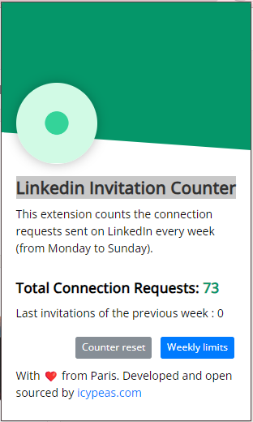

# Linkedin Invitation Counter

<h1 align="center">
The Icypeas team is proud to present LinkedIn Invitation Counter, a free and open-source solution designed to count the number of times you click "Connect" on LinkedIn.
</h1>

    

## 💻 Install the project in developer mode

- [ ] Download the entire project
- [ ] Go to Chrome > Settings > Extensions > Developer mode > Load unpacked extension
- [ ] Select the project directory
- [ ] Enable the extension

## 🚦 Usage

- [ ] Press the "Connect" button.
- [ ] The counter increases by 1.
- [ ] Every Sunday at 11:59 PM, the counter resets to zero.

Seamlessly manage your LinkedIn connections—just another way our startup approach enhances your workflow.

This video demonstrates how to use it :

<animated-image data-catalyst="">

https://github.com/icypeas/LinkedIn-connection-counter/assets/137278677/befb6044-463c-4be6-9c6b-c199725e23bc

## 📋 Files

- [ ] manifest.json: This file contains essential information about the Chrome extension, such as its name, version, description, permissions, and scripts. It also includes declarations of entry points, namely the popup page and content scripts.
- [ ] popup.html: Responsible for defining the popup page of the extension, visible when the user interacts with the extension icon.
- [ ] popup.js: The JavaScript script linked to the popup page. It manages user events and interactions that occur on the popup page, like buttons and links.
- [ ] content.js: An injected content script operating within the web page, handling actions like button clicks.
- [ ] jsconfig.js (includes the chrome package to enable auto-completion in VSCode).

##  👨‍💻 Support

If you have any questions or require assistance, don't hesitate to reach out. Our dedicated support team is here to help you every step of the way. Contact us at support@icypeas.com for prompt and reliable assistance
